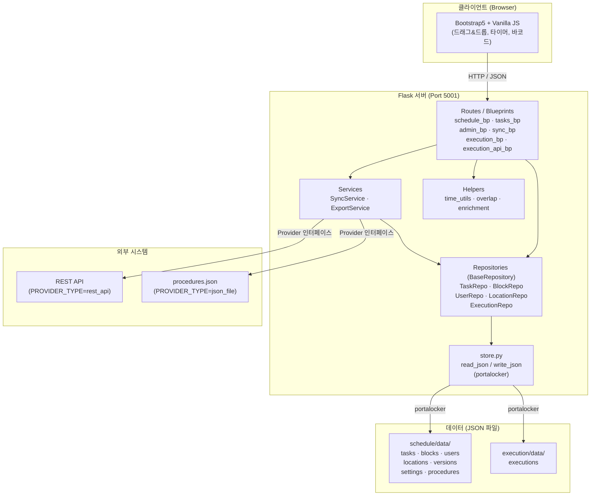
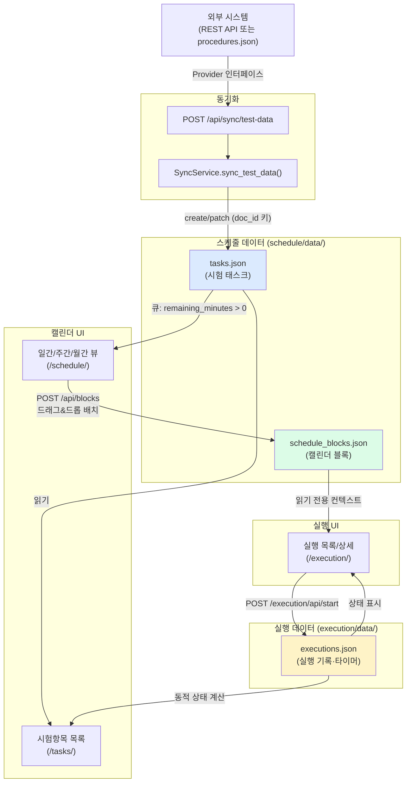
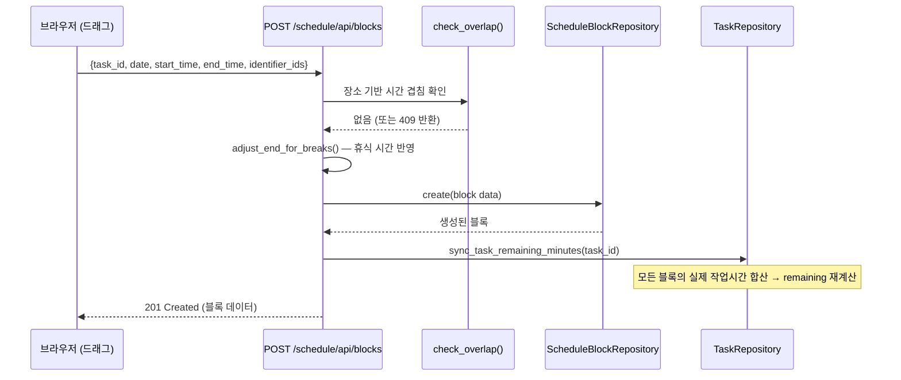
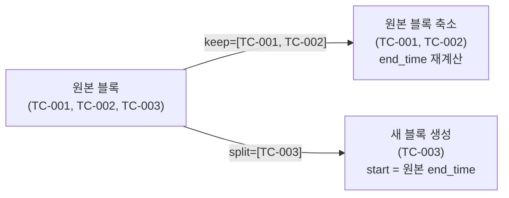
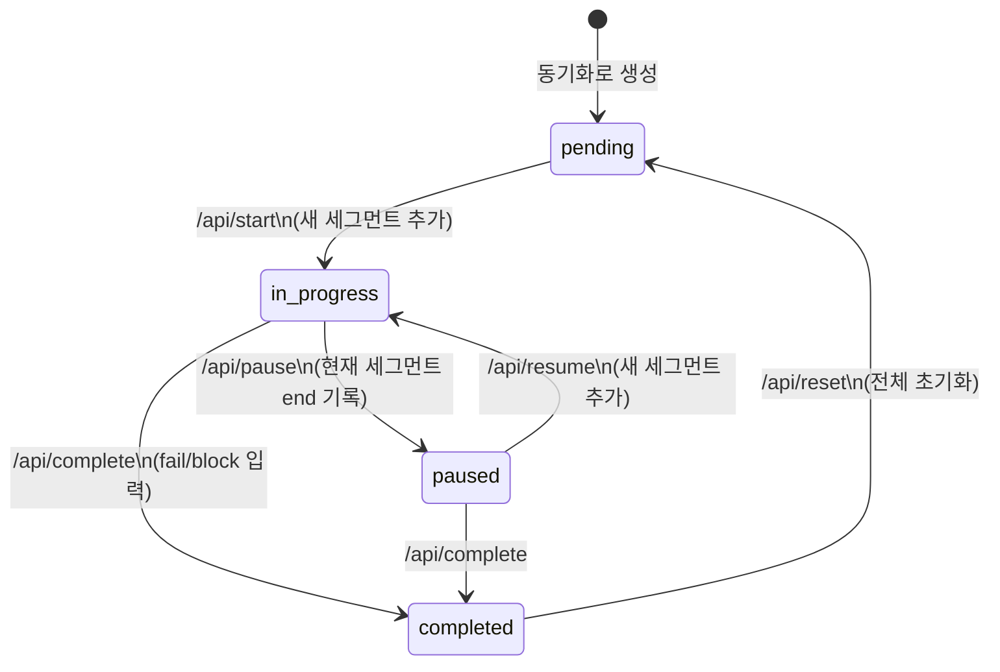
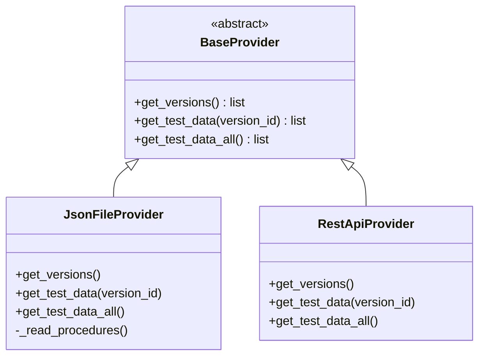
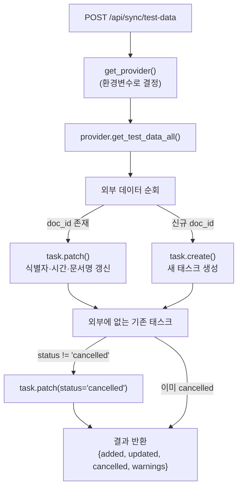

# 시스템 아키텍처 문서 — 소프트웨어 시험 절차 스케줄링 서비스

> **대상 독자:** 이 프로젝트에 처음 합류하는 개발자  
> **목표:** 30분 안에 전체 구조를 파악할 수 있도록 작성

---

## 목차

1. [시스템 개요](#1-시스템-개요)
2. [아키텍처 구조](#2-아키텍처-구조)
3. [데이터 모델](#3-데이터-모델)
4. [데이터 흐름](#4-데이터-흐름)
5. [주요 API](#5-주요-api)
6. [실행 흐름 (타이머 & 세그먼트)](#6-실행-흐름)
7. [동기화 흐름](#7-동기화-흐름)
8. [설정 및 실행 방법](#8-설정-및-실행-방법)

---

## 1. 시스템 개요

### 한 문장 요약

소프트웨어 시험 담당자들이 **시험 절차(Test Procedure)를 캘린더에 배치하고, 실시간으로 실행·추적**하는 내부 도구입니다.

### 주요 사용 흐름

```
외부 시스템 → [동기화] → 시험항목 큐 → [캘린더 배치] → [실행·타이머] → 결과 추적
```

1. **동기화 (Sync):** 외부 시스템 또는 로컬 JSON 파일에서 시험 절차 목록을 가져와 내부 `tasks.json`에 저장합니다.
2. **스케줄링 (Schedule):** 담당자가 캘린더(일간/주간/월간)에 시험 블록을 드래그&드롭으로 배치합니다.
3. **실행 (Execution):** 시험 실행 페이지에서 타이머를 시작하고, pass/fail/block 수를 입력하며, 바코드 스캐너로 자동 이동합니다.

### 기술 스택

| 계층 | 기술 |
|------|------|
| 백엔드 | Python 3.9 · Flask · Jinja2 |
| 프론트엔드 | Bootstrap 5 · Vanilla JS (ES6+) |
| 데이터 저장 | JSON 파일 (DB 없음) |
| 파일 잠금 | portalocker |
| 엑셀 내보내기 | openpyxl |
| 테스트 | pytest |
| 포트 | **5001** (macOS AirPlay가 5000 점유) |

---

## 2. 아키텍처 구조

### 디렉터리 레이아웃

```
scheduling/
├── run.py                          # 진입점 (Flask dev server, port 5001)
├── migrate_data.py                 # 데이터 마이그레이션 스크립트
├── requirements.txt
├── app/
│   ├── __init__.py                 # create_app() 팩토리 — 블루프린트 등록
│   ├── config.py                   # OfpidSettings (활성 버전 조회)
│   │
│   ├── features/
│   │   ├── schedule/               # 스케줄 도메인
│   │   │   ├── data/               # JSON 파일 저장소
│   │   │   │   ├── tasks.json
│   │   │   │   ├── schedule_blocks.json
│   │   │   │   ├── locations.json
│   │   │   │   ├── users.json
│   │   │   │   ├── versions.json
│   │   │   │   ├── settings.json
│   │   │   │   └── procedures.json
│   │   │   ├── models/             # Repository 계층 (BaseRepository 상속)
│   │   │   │   ├── base.py         # BaseRepository — read/write/CRUD
│   │   │   │   ├── task.py
│   │   │   │   ├── schedule_block.py
│   │   │   │   ├── user.py
│   │   │   │   ├── location.py
│   │   │   │   ├── version.py
│   │   │   │   └── settings.py
│   │   │   ├── providers/          # 외부 데이터 소스 플러그인
│   │   │   │   ├── base.py         # BaseProvider (추상 클래스)
│   │   │   │   ├── json_file.py    # 기본 — procedures.json 읽기
│   │   │   │   └── rest_api.py     # 선택 — 외부 REST API 호출
│   │   │   ├── routes/             # Flask 블루프린트 (라우트)
│   │   │   │   ├── calendar_views.py   # schedule_bp: 뷰 페이지
│   │   │   │   ├── calendar_api.py     # schedule_bp: 블록 CRUD API
│   │   │   │   ├── calendar_helpers.py # 블록↔태스크 동기화 헬퍼
│   │   │   │   ├── tasks.py            # tasks_bp: 시험항목 CRUD
│   │   │   │   ├── admin.py            # admin_bp: 설정·사용자·장소 관리
│   │   │   │   └── sync.py             # sync_bp: 동기화 API
│   │   │   ├── helpers/
│   │   │   │   ├── time_utils.py   # 시간 변환·휴식 처리·슬롯 생성
│   │   │   │   ├── overlap.py      # 겹침 감지·레이아웃 계산
│   │   │   │   └── enrichment.py   # 블록에 UI용 부가 정보 추가
│   │   │   ├── services/
│   │   │   │   ├── sync.py         # SyncService — 외부→내부 병합 로직
│   │   │   │   ├── procedure.py    # 절차 서비스
│   │   │   │   └── export.py       # CSV/XLSX 내보내기
│   │   │   └── store.py            # read_json / write_json / generate_id
│   │   │
│   │   └── execution/              # 실행 도메인
│   │       ├── data/
│   │       │   └── executions.json
│   │       ├── models/
│   │       │   └── execution.py    # ExecutionRepository
│   │       ├── routes/
│   │       │   ├── views.py        # execution_bp: 목록·상세 페이지
│   │       │   ├── api.py          # execution_api_bp: 타이머 REST API
│   │       │   └── execution_views.py
│   │       ├── helpers/
│   │       ├── store.py
│   │       └── barcode_config.py   # IDENTIFIER_PREFIX 설정
│   │
│   ├── templates/                  # Jinja2 템플릿
│   │   ├── schedule/
│   │   └── execution/
│   └── static/                     # JS·CSS
│       ├── schedule/
│       └── execution/
│
└── tests/                          # pytest (176개)
```

### 계층 구조도



### 블루프린트 URL 매핑

| 블루프린트 | prefix | 주요 역할 |
|-----------|--------|-----------|
| `schedule_bp` | `/schedule` | 캘린더 뷰 + 블록 CRUD API |
| `tasks_bp` | `/tasks` | 시험항목 목록/상세/수정 |
| `admin_bp` | `/admin` | 설정·사용자·장소·버전 관리 |
| `sync_bp` | `/api/sync` | 외부 데이터 동기화 |
| `execution_bp` (views) | `/execution` | 실행 목록·상세 페이지 |
| `execution_api_bp` | `/execution/api` | 타이머 REST API |

루트 URL(`/`)은 `/schedule/week`(주간 뷰)로 리다이렉트됩니다.

---

## 3. 데이터 모델

### 3.1 schedule 도메인 (`app/features/schedule/data/`)

#### tasks.json — 시험 태스크

한 건의 문서(시험 절차서) 단위로 묶인 태스크입니다.

```jsonc
{
  "id": "t_a1b2c3d4",          // 자동 생성 (prefix: 't_')
  "doc_id": 1001,               // 외부 문서 ID (int, 동기화 키)
  "doc_name": "SW 시험 절차서 1장",
  "version_id": "v_abc123",
  "assignee_names": ["홍길동", "이순신"],  // 시험 담당자 이름 배열 (users.json의 name 값)
  "location_id": "loc_xyz",
  "identifiers": [              // 시험 식별자 목록 (TC 단위)
    {
      "id": "TC-001",
      "name": "기능 시험 1",
      "owners": ["김작성자"],   // 식별자 작성자 (담당자와 다른 그룹)
      "estimated_minutes": 60
    }
  ],
  "estimated_minutes": 120,     // 식별자 시간 합계
  "remaining_minutes": 60,      // 아직 배치되지 않은 잔여 시간
  "memo": "",
  "created_at": "2026-04-01T09:00:00",
  "status": "cancelled"         // 'cancelled'만 사용 (외부에서 삭제된 태스크)
}
```

> **주의:** `status` 필드는 `'cancelled'` 값에만 의미가 있습니다. 일반적인 진행 상태(대기/진행/완료)는 `executions.json`에서 동적으로 계산합니다.

#### schedule_blocks.json — 캘린더 블록

캘린더에 배치된 시험 일정 단위입니다. 하나의 태스크에서 여러 블록이 생성될 수 있습니다 (블록 분리).

```jsonc
{
  "id": "sb_e5f6g7h8",
  "task_id": "t_a1b2c3d4",      // 연결된 태스크 (간단 블록이면 null)
  "assignee_names": ["홍길동"],
  "location_id": "loc_xyz",
  "date": "2026-05-13",          // YYYY-MM-DD
  "start_time": "09:00",         // HH:MM
  "end_time": "11:00",           // HH:MM (휴식 시간 포함 조정 후 값)
  "is_locked": false,            // true이면 이동/리사이즈/일괄이동 제외
  "block_status": "pending",     // pending | in_progress | completed | cancelled
  "identifier_ids": ["TC-001"],  // null이면 태스크 전체 식별자를 커버
  "is_simple": false,            // true이면 태스크 없는 비시험 블록
  "title": "",                   // is_simple=true일 때 사용
  "overflow_minutes": 0,         // 당일 근무 종료 초과분 (다음날 자동 생성)
  "memo": ""
}
```

#### users.json — 팀원/시험 담당자

```jsonc
{
  "id": "u_11223344",
  "name": "홍길동",
  "role": "시험원",
  "color": "#4A90D9"
}
```

> **중요:** 담당자 참조는 `id`가 아닌 **`name`** 기반입니다. `users_map`도 `name`을 키로 사용합니다.

#### locations.json — 시험 장소

```jsonc
{
  "id": "loc_xyz",
  "name": "1번 시험실",
  "color": "#22C55E",
  "description": ""
}
```

#### versions.json — 시험 버전 (외부 OFP ID)

```jsonc
{
  "id": "v_abc123",
  "name": "OFP-2026-A",
  "description": "",
  "is_active": true,
  "created_at": "2026-01-01T00:00:00"
}
```

#### settings.json — 시스템 설정

```jsonc
{
  "work_start": "08:30",
  "work_end": "17:30",
  "actual_work_start": "08:30",   // 실제 시작 (그리드 표시 기준)
  "actual_work_end": "17:30",
  "lunch_start": "12:00",
  "lunch_end": "13:00",
  "breaks": [                      // 추가 휴식 시간 목록
    {"start": "10:00", "end": "10:15"}
  ],
  "grid_interval_minutes": 15,     // 주간 뷰 그리드 간격 (일간은 고정 5분)
  "max_schedule_days": 90,
  "block_color_by": "assignee"     // "assignee" | "location"
}
```

#### procedures.json — 외부 시험 절차 원본 (동기화 소스)

```jsonc
{
  "version_id": "v_abc123",
  "doc_id": 1001,
  "doc_name": "SW 시험 절차서 1장",
  "identifiers": [
    {
      "id": "TC-001",
      "name": "기능 시험 1",
      "owners": ["김작성자"],
      "estimated_minutes": 60
    }
  ]
}
```

### 3.2 execution 도메인 (`app/features/execution/data/`)

#### executions.json — 시험 실행 기록

```jsonc
{
  "id": "ex_99aabbcc",
  "identifier_id": "TC-001",      // 식별자 ID (1:1 관계)
  "task_id": "t_a1b2c3d4",
  "status": "in_progress",        // pending | in_progress | paused | completed
  "segments": [                   // 타이머 세그먼트
    {"start": "2026-05-13T09:05:00", "end": "2026-05-13T10:00:00"},
    {"start": "2026-05-13T10:15:00", "end": null}  // null = 현재 진행 중
  ],
  "total_count": 10,              // 전체 시험 항목 수
  "fail_count": 1,
  "block_count": 0,
  "pass_count": 9,                // max(0, total - fail - block)
  "comment": "특이사항 없음",
  "performer": "홍길동",           // 실제 수행자 이름
  "created_at": "2026-05-13T09:05:00",
  "completed_at": null,           // 완료 시각
  "elapsed_seconds": 0            // 완료/일시정지 시 캐시값
}
```

### 3.3 ID 생성 규칙

모든 ID는 `{prefix}{uuid4.hex[:8]}` 형태로 자동 생성됩니다.

| 엔티티 | prefix | 예시 |
|--------|--------|------|
| Task | `t_` | `t_a1b2c3d4` |
| ScheduleBlock | `sb_` | `sb_e5f6g7h8` |
| User | `u_` | `u_11223344` |
| Location | `loc_` | `loc_xyz1` |
| Version | `v_` | `v_abc123` |
| Execution | `ex_` | `ex_99aabbcc` |

### 3.4 태스크 상태 동적 계산 (/tasks/ 페이지)

tasks.json에 상태를 저장하지 않고, executions.json에서 **매 요청마다 동적으로 계산**합니다.

```python
# 태스크의 모든 식별자에 대해 execution 기록을 조회 후 집계
if all identifiers completed:    → "완료"
elif any identifier in (in_progress | paused | completed):  → "진행 중"
else:                            → "대기"

# 시간 열 표시
"완료된 식별자 예상시간 합 / 전체 예상시간"
# 예: 120분 / 240분
```

---

## 4. 데이터 흐름

### 4.1 전체 흐름도



> **단방향 데이터 흐름 원칙:**  
> `execution → schedule` 방향의 write-back이 없습니다. `executions.json`은 독립적으로 기록되며, 스케줄 데이터는 실행 화면에서 **읽기 전용 컨텍스트**로만 참조됩니다.

### 4.2 블록 배치와 잔여 시간 동기화

블록 생성/수정/삭제 시, `sync_task_remaining_minutes(task_id)`가 항상 호출됩니다.



### 4.3 시간 초과 시 다음날 자동 넘김

블록 종료 시간이 `actual_work_end`를 초과하면:

1. 현재 블록의 `end_time`을 `work_end`로 클램핑
2. 초과분(`overflow_minutes`)을 계산
3. 다음 평일 근무 시작 시각부터 연속 블록을 자동 생성
4. 겹침이 있으면 생성 중단, `overflow_minutes = 0` 리셋

### 4.4 블록 분리 (우클릭 → 분리)



---

## 5. 주요 API

### 5.1 스케줄 API

| Method | URL | 설명 |
|--------|-----|------|
| `GET` | `/schedule/` | 일간 뷰 페이지 |
| `GET` | `/schedule/week` | 주간 뷰 페이지 |
| `GET` | `/schedule/month` | 월간 뷰 페이지 |
| `GET` | `/schedule/api/day` | 일간 블록 데이터 JSON |
| `POST` | `/schedule/api/blocks` | 블록 생성 (드래그&드롭 배치) |
| `PUT` | `/schedule/api/blocks/<id>` | 블록 수정 (이동/리사이즈) |
| `DELETE` | `/schedule/api/blocks/<id>` | 블록 삭제 (`?restore=1` 시 큐 복원) |
| `PUT` | `/schedule/api/blocks/<id>/lock` | 잠금 토글 |
| `PUT` | `/schedule/api/blocks/<id>/status` | `block_status` 수동 변경 |
| `PUT` | `/schedule/api/blocks/<id>/memo` | 블록 메모 수정 |
| `POST` | `/schedule/api/blocks/<id>/split` | 블록 분리 (식별자 선택) |
| `POST` | `/schedule/api/blocks/<id>/return-identifiers` | 선택 식별자 큐 복원 |
| `POST` | `/schedule/api/blocks/shift` | 날짜 이후 블록 일괄 +1/-1일 이동 |
| `GET` | `/schedule/api/blocks/by-task/<task_id>` | 태스크별 블록 조회 |
| `GET` | `/schedule/api/export` | CSV/XLSX 내보내기 |
| `POST` | `/schedule/api/simple-blocks` | 비시험 간단 블록 태스크 생성 |

### 5.2 시험항목 API

| Method | URL | 설명 |
|--------|-----|------|
| `GET` | `/tasks/` | 시험항목 목록 (필터: status/assignee/location/doc/date) |
| `GET` | `/tasks/<id>` | 시험항목 상세 페이지 |
| `POST` | `/tasks/` | 태스크 생성 |
| `PUT` | `/tasks/<id>` | 태스크 수정 |
| `DELETE` | `/tasks/<id>` | 태스크 삭제 |

### 5.3 동기화 API

| Method | URL | 설명 |
|--------|-----|------|
| `POST` | `/api/sync/versions` | 버전 목록 동기화 |
| `POST` | `/api/sync/test-data` | 시험 데이터 동기화 (선택적 version_id) |
| `POST` | `/api/sync/reset-and-sync` | 전체 리셋 후 재동기화 |
| `GET` | `/api/sync/status` | 현재 버전/태스크 수 조회 |

### 5.4 실행 API

| Method | URL | 설명 |
|--------|-----|------|
| `GET` | `/execution/` | 실행 목록 페이지 |
| `GET` | `/execution/<identifier_id>` | 시험 실행 상세 (타이머 화면) |
| `GET` | `/execution/api/list` | 실행 목록 JSON (`?date=&location=` 필터) |
| `GET` | `/execution/api/item/<identifier_id>` | 식별자 단건 실행 정보 |
| `POST` | `/execution/api/start` | 시험 시작 (타이머 시작, 세그먼트 추가) |
| `POST` | `/execution/api/pause` | 일시정지 (현재 세그먼트 종료) |
| `POST` | `/execution/api/resume` | 재시작 (새 세그먼트 추가) |
| `POST` | `/execution/api/complete` | 완료 (fail/block 수 입력, elapsed 계산) |
| `PUT` | `/execution/api/comment` | 코멘트 저장 |
| `PUT` | `/execution/api/performer` | 수행자 저장 |
| `PUT` | `/execution/api/pending-comment` | 시작 전 코멘트 저장 |
| `PATCH` | `/execution/api/timing/<identifier_id>` | 외부 소요시간 수신 → estimated_minutes 갱신 |
| `POST` | `/execution/api/reset` | 실행 초기화 (`pending` 상태로 복원) |
| `POST` | `/execution/api/login` | 세션 사용자명 설정 |
| `GET` | `/execution/api/whoami` | 현재 세션 사용자명 조회 |

### 5.5 관리 API

| Method | URL | 설명 |
|--------|-----|------|
| `GET`/`POST` | `/admin/settings` | 시스템 설정 조회/수정 |
| `GET`/`POST` | `/admin/users` | 사용자 목록/생성 |
| `PUT`/`DELETE` | `/admin/users/<id>` | 사용자 수정/삭제 |
| `GET`/`POST` | `/admin/locations` | 장소 목록/생성 |
| `PUT`/`DELETE` | `/admin/locations/<id>` | 장소 수정/삭제 |
| `GET`/`POST` | `/admin/versions` | 버전 목록/생성 |
| `PUT`/`DELETE` | `/admin/versions/<id>` | 버전 수정/삭제 |

---

## 6. 실행 흐름

### 6.1 타이머 세그먼트 모델

실행 시간은 `segments` 배열로 서버에 저장됩니다. 연속 기록이 아닌 **세그먼트 합산** 방식입니다.

```
segments = [
  {"start": "2026-05-13T09:00:00", "end": "2026-05-13T09:30:00"},  ← 30분 (완료)
  {"start": "2026-05-13T10:00:00", "end": null}                    ← 진행 중
]

elapsed = Σ(end - start) for closed + (now - start) for open
```

클라이언트 JS는 1초마다 `elapsed_seconds`를 재계산하여 표시합니다. 서버는 pause/resume/complete 시에만 `segments`를 기록합니다.



### 6.2 완료 시 카운트 계산

```python
# POST /execution/api/complete
pass_count = max(0, total_count - fail_count - block_count)
elapsed_seconds = compute_elapsed_seconds(segments)
```

완료 후 `elapsed_seconds`를 외부 API(`/update_test_time`)에 비동기 전송합니다 (`API_BASE_URL` 설정 시).

### 6.3 바코드 스캐너 연동

```
바코드 입력 감지 조건: 문자 간격 80ms 이하인 연속 입력

입력 형식:
  OPEN|TC-001    →  /execution/TC-001?autostart=1 이동 + 자동 시작
  TERMINATE      →  현재 실행 일시정지

identifier_id 조합:
  barcode_config.py의 IDENTIFIER_PREFIX + 바코드 파싱 결과
  예) IDENTIFIER_PREFIX='A-BCD-', 입력='OPEN|TC-001' → 'A-BCD-TC-001'
```

---

## 7. 동기화 흐름

### 7.1 Provider 플러그인 구조



환경 변수 `PROVIDER_TYPE`으로 선택합니다:

```bash
# 기본 — data/procedures.json 파일 읽기
PROVIDER_TYPE=json_file

# REST API 연동
PROVIDER_TYPE=rest_api
API_BASE_URL=https://external-system.example.com
API_KEY=your-api-key
```

### 7.2 동기화 로직 상세



**매칭 키:** `doc_id` (정수). 동일 `doc_id`의 기존 태스크를 찾으면 갱신, 없으면 신규 생성합니다.

**`reset-and-sync` 순서:**

1. `schedule_blocks.json` 초기화
2. `tasks.json` 초기화
3. `versions.json` 초기화
4. `executions.json` 초기화
5. 버전 동기화 (`sync_versions`)
6. 시험 데이터 동기화 (`sync_test_data`)

---

## 8. 설정 및 실행 방법

### 8.1 서버 실행

```bash
# 가상환경 활성화 (필수)
source venv/bin/activate

# 서버 실행 (port 5001)
python3 run.py
```

브라우저에서 `http://localhost:5001` 접속 → 주간 뷰로 자동 이동

### 8.2 테스트 실행

```bash
source venv/bin/activate
pytest tests/ -v          # 전체 테스트 (176개)
pytest tests/test_execution.py -v  # 특정 파일만
```

### 8.3 데이터 마이그레이션

```bash
python migrate_data.py
```

### 8.4 환경 변수

| 변수 | 기본값 | 설명 |
|------|--------|------|
| `PROVIDER_TYPE` | `json_file` | 데이터 소스 (`json_file` 또는 `rest_api`) |
| `API_BASE_URL` | _(없음)_ | `rest_api` 사용 시 외부 API 기본 URL |
| `API_KEY` | _(없음)_ | 외부 API 인증 키 (Bearer 토큰) |
| `SECRET_KEY` | `dev-secret-key` | Flask 세션 시크릿 키 (운영 시 반드시 변경) |

### 8.5 주요 설계 결정 사항

1. **DB 없음:** 모든 데이터는 JSON 파일. `portalocker`로 동시 접근 시 파일 잠금 보장. 쓰기 전 `.bak` 자동 백업.

2. **단방향 데이터 흐름:** `execution` → `schedule` write-back 없음. 실행 상태는 `executions.json`에서만 읽습니다.

3. **담당자 참조는 이름 기반:** `assignee_names`는 이름 배열. `users_map`도 `name`을 키로 사용.

4. **겹침 감지는 장소 기반:** 같은 담당자가 다른 장소에서 동시간대 배치 가능. 같은 장소 내 시간 겹침만 차단.

5. **시간 계산:** 모든 블록 시간은 분 단위 정밀도. 그리드 스냅 없음. 휴식 시간은 `adjust_end_for_breaks()`로 자동 반영.

6. **Block 색상:** `settings.block_color_by` 값에 따라 담당자 색상 또는 장소 색상 사용.

---

## 부록: 핵심 내부 함수 참조

### store.py

```python
read_json(filename)       # JSON 파일 읽기 (portalocker, 없으면 [] 또는 {} 반환)
write_json(filename, data) # JSON 파일 쓰기 (.bak 백업 후 기록)
generate_id(prefix)       # "{prefix}{uuid4.hex[:8]}" ID 생성
```

### time_utils.py

```python
time_to_minutes("09:30")            # → 570
minutes_to_time(570)                # → "09:30"
adjust_end_for_breaks(start, end, settings)  # 휴식 반영 종료 시간 계산
work_minutes_in_range(start, end, settings)  # 순수 작업 시간(분) 계산
generate_time_slots(settings)       # 시간표 슬롯 목록 생성
is_break_slot(time_str, settings)   # 해당 시간이 휴식 시간인지 확인
```

### overlap.py

```python
check_overlap(assignee_names, location_id, date_str, start_time, end_time,
              exclude_block_id=None, exclude_task_id=None)
# → 겹치는 블록 dict 또는 None

compute_overlap_layout(blocks)
# → col_index, col_total 추가된 블록 목록 (같은 시간대 블록 나란히 배치용)
```

### ExecutionRepository 주요 메서드

```python
ExecutionRepository.start(identifier_id, task_id, total_count)  # 새 세그먼트 추가
ExecutionRepository.pause(execution_id)   # 현재 세그먼트 end 기록
ExecutionRepository.resume(execution_id)  # 새 세그먼트 추가
ExecutionRepository.complete(execution_id, fail_count, block_count)
ExecutionRepository.compute_elapsed_seconds(segments)  # 세그먼트 합산 (초)
ExecutionRepository.reset(execution_id)   # pending 상태로 초기화
```
