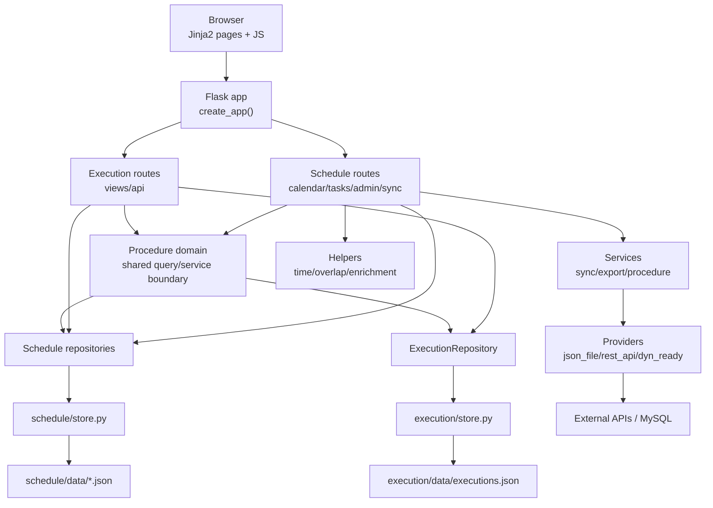

# 시스템 아키텍처 문서

소프트웨어 시험 절차를 동기화하고, 캘린더에 배치하고, 식별자별 실행 결과를 추적하는 Flask 기반 내부 도구다.

## 1. 빠른 이해

1. 외부 시스템 또는 로컬 JSON에서 시험 절차를 가져온다.
2. 절차는 `tasks.json`의 task와 `identifiers[]`로 저장된다.
3. 사용자는 task를 큐에서 캘린더로 드래그해 `schedule_blocks.json` 블록을 만든다.
4. 실행 화면은 배치된 식별자를 읽어 타이머와 결과를 `executions.json`에 저장한다.
5. task의 일반 진행 상태는 저장하지 않고 execution 상태에서 계산한다.

```text
Provider -> SyncService -> tasks.json -> Procedure Service -> Calendar / Execution
```

## 2. 기술 스택

| 계층 | 기술 |
| --- | --- |
| 백엔드 | Python, Flask, Jinja2 |
| 프론트엔드 | Bootstrap 5, Bootstrap Icons, Vanilla JavaScript |
| 저장소 | JSON 파일 |
| 동시성 보호 | portalocker 파일 잠금 |
| 외부 연동 | requests, PyMySQL |
| 내보내기 | openpyxl, CSV |
| 테스트/포맷 | pytest, ruff |
| 개발 서버 | `python3 run.py`, port `5001` |

## 3. 디렉터리 구조

```text
scheduling/
├── run.py
├── requirements.txt
├── pyproject.toml
├── app/
│   ├── __init__.py
    │   ├── config.py
│   ├── domains/
│   │   └── procedure/
│   │       └── service.py
│   ├── features/
│   │   ├── schedule/
│   │   │   ├── data/
│   │   │   ├── models/
│   │   │   ├── providers/
│   │   │   ├── routes/
│   │   │   ├── helpers/
│   │   │   ├── services/
│   │   │   └── store.py
│   │   └── execution/
│   │       ├── data/
│   │       ├── models/
│   │       ├── routes/
│   │       ├── barcode_config.py
│   │       └── store.py
│   ├── templates/
│   │   ├── layouts/
│   │   ├── schedule/
│   │   └── execution/
│   └── static/
│       ├── schedule/
│       └── execution/
├── scripts/
├── tests/
└── docs/
```

## 4. 런타임 구성



## 5. 도메인 경계

| 도메인 | 책임 | 저장 위치 |
| --- | --- | --- |
| Schedule | 시험 절차, 큐, 캘린더 블록, 설정, 기준정보, 동기화 | `app/features/schedule` |
| Execution | 식별자별 실행, 타이머, 수행자, 결과 카운트, 완료 알림 | `app/features/execution` |
| Procedure Domain | Schedule/Execution 데이터를 task+identifier 기준으로 조합하는 공통 경계 | `app/domains/procedure` |

Schedule과 Execution은 서로의 Repository를 직접 조합하지 않고 Procedure Service를 통해 공유 데이터를 읽는다.
현재 저장 파일은 기존 호환성을 위해 분리되어 있으며, Procedure Service가 `task_id + identifier_id` 기준으로 조합한다.

## 6. 핵심 데이터 구조

### 6.1 Task

Task는 문서/절차 단위다.

```json
{
  "id": "t_...",
  "doc_id": 1001,
  "version_id": "ofp_001",
  "exam_no": 2,
  "doc_name": "시험 절차서",
  "assignee_names": ["홍길동"],
  "location_id": "loc_...",
  "identifiers": [
    {"id": "TC-001", "name": "기능 시험", "estimated_minutes": 60, "owners": ["김작성"]}
  ],
  "estimated_minutes": 60,
  "remaining_minutes": 60
}
```

중요 규칙:

1. 같은 `exam_no` 안에서만 식별자 중복을 막는다.
2. `exam_no`가 다르면 같은 식별자 ID도 별도 재시험으로 허용한다.
3. `estimated_minutes`는 식별자 예상 시간 합이다.
4. 일반 상태는 task에 저장하지 않는다.

### 6.2 ScheduleBlock

Block은 캘린더에 배치된 일정 단위다.

```json
{
  "id": "sb_...",
  "task_id": "t_...",
  "date": "2026-05-13",
  "start_time": "09:00",
  "end_time": "10:00",
  "location_id": "loc_...",
  "identifier_ids": ["TC-001"],
  "block_status": "pending",
  "is_locked": false
}
```

`identifier_ids=null`이면 해당 task의 모든 식별자가 이 블록에 포함된 것으로 본다.

### 6.3 Execution

Execution은 식별자 실행 레코드다.

```json
{
  "id": "ex_...",
  "identifier_id": "TC-001",
  "task_id": "t_...",
  "exam_no": 2,
  "status": "in_progress",
  "segments": [{"start": "2026-05-13T09:00:00", "end": null}],
  "total_count": 10,
  "fail_count": 0,
  "block_count": 0,
  "pass_count": 0
}
```

실행 레코드는 `(identifier_id, task_id)` 조합으로 식별한다.

## 7. 데이터 흐름

화면, API, 서비스, 저장 파일 사이의 상세 입출력 흐름은 `docs/data-flow.md`를 기준으로 한다.

### 7.1 동기화

1. 사용자가 `/api/sync/test-data`를 호출한다.
2. `providers.get_provider()`가 `PROVIDER_TYPE`에 맞는 provider를 만든다.
3. provider가 외부/로컬 절차 데이터를 반환한다.
4. `SyncService.sync_test_data()`가 `(doc_id, exam_no)` 조합을 만든다.
5. 기존 task가 있으면 identifiers, estimated_minutes, doc_name, version_id를 갱신한다.
6. 새 조합이면 task를 생성한다.
7. 이번 동기화에서 사라진 task는 삭제한다. 이미 블록이 있으면 삭제하지 않고 경고한다.

지원 provider:

| `PROVIDER_TYPE` | 설명 |
| --- | --- |
| `json_file` | `procedures.json`, `versions.json` 사용 |
| `rest_api` | `API_BASE_URL`의 `/versions`, `/procedures` 사용. URL 없으면 `json_file`로 폴백 |
| `dyn_ready` | `DYN_READY_URL/dyn_ready/std-list/grouped` 사용 |

### 7.2 스케줄링

1. `/schedule/week`가 task 큐와 block을 렌더링한다.
2. 사용자가 큐 항목을 시간표로 드래그한다.
3. 프론트엔드가 선택한 식별자와 드롭 위치를 `/schedule/api/blocks`에 보낸다.
4. 백엔드는 겹침, 휴식 시간, 업무 종료 초과, 식별자 이동 규칙을 적용한다.
5. block을 생성하고 task의 잔여 시간을 재계산한다.
6. 화면이 갱신되면 큐에는 미배치 식별자만 남는다.

### 7.3 실행

1. `/execution/`이 배치된 식별자 목록을 보여준다.
2. `/execution/api/list`는 task, block, location, execution을 조합한다.
3. 실행 레코드가 없는 식별자는 pending으로 표시한다.
4. 시작 시 `/execution/api/start`가 execution 레코드를 만들거나 기존 레코드를 초기화한다.
5. 일시정지/재개는 `segments[]`를 닫고 새로 연다.
6. 완료 시 실패/블록/통과 건수와 완료 시각을 저장한다.
7. `API_BASE_URL`이 있으면 완료 시간을 외부 `/update_test_time`으로 비동기 전송한다.

## 8. URL 맵

| 영역 | 주요 URL |
| --- | --- |
| 메인 | `/` -> `/schedule/week` |
| 스케줄 페이지 | `/schedule/`, `/schedule/week`, `/schedule/month` |
| 스케줄 API | `/schedule/api/day`, `/schedule/api/week`, `/schedule/api/month`, `/schedule/api/blocks*` |
| Task | `/tasks/`, `/tasks/new`, `/tasks/<id>`, `/tasks/api/*` |
| Admin | `/admin/settings`, `/admin/users`, `/admin/locations`, `/admin/api/*` |
| Sync | `/api/sync/versions`, `/api/sync/test-data`, `/api/sync/std-list`, `/api/sync/status` |
| Execution | `/execution/`, `/execution/<identifier_id>`, `/execution/api/*` |

상세 API 표는 `docs/BACKEND.md`를 기준 문서로 삼는다.

## 9. 시간 계산 규칙

| 개념 | 설명 |
| --- | --- |
| `work_start`, `work_end` | 화면에 보이는 시간 범위 |
| `actual_work_start`, `actual_work_end` | 자동 배치와 초과 판단 기준 |
| `lunch_start`, `lunch_end`, `breaks[]` | 작업 시간에서 제외되는 휴식 |
| `grid_interval_minutes` | 슬롯 크기 |
| `remaining_minutes` | 아직 큐에 남아야 하는 예상 시간 |

블록 생성/이동 시 업무 종료를 초과하면 다음 근무일로 이어지는 블록을 만든다. 주말은 건너뛴다.

## 10. 환경 변수

| 변수 | 기본값 | 설명 |
| --- | --- | --- |
| `SECRET_KEY` | `dev-secret-key` | Flask 세션 키 |
| `PROVIDER_TYPE` | `json_file` | `json_file`, `rest_api`, `dyn_ready` |
| `API_BASE_URL` | 없음 | REST provider 및 execution 완료 시간 전송 대상 |
| `API_KEY` | 없음 | 외부 API Bearer 토큰 |
| `DYN_READY_URL` | `http://127.0.0.1:5000` | dyn_ready provider 기본 URL |
| `FLASK_ENV` | `development` | MySQL DB 이름 선택에 사용 |
| `MYSQL_HOST` | `localhost` | `std_list` 동기화 DB host |
| `MYSQL_PORT` | `3306` | DB port |
| `MYSQL_USER` | 없음 | DB user |
| `MYSQL_PASSWORD` | 없음 | DB password |
| `MYSQL_DB_DEV` | 없음 | 개발 DB |
| `MYSQL_DB_PROD` | 없음 | 운영 DB |

## 11. 로컬 실행

```bash
python3 -m venv .venv
source .venv/bin/activate
pip install -r requirements.txt
python3 run.py
```

브라우저에서 `http://localhost:5001`을 연다.

검증:

```bash
pytest
ruff format --check .
```

## 12. 관련 문서

| 문서 | 내용 |
| --- | --- |
| `docs/BACKEND.md` | 백엔드 라우트, 저장소, 서비스 상세 |
| `docs/FRONTEND.md` | 템플릿, JS 모듈, UI 흐름 |
| `docs/data-files.md` | JSON 파일별 스키마 |
| `docs/PRD.md` | 제품 요구사항과 사용자 기능 |
