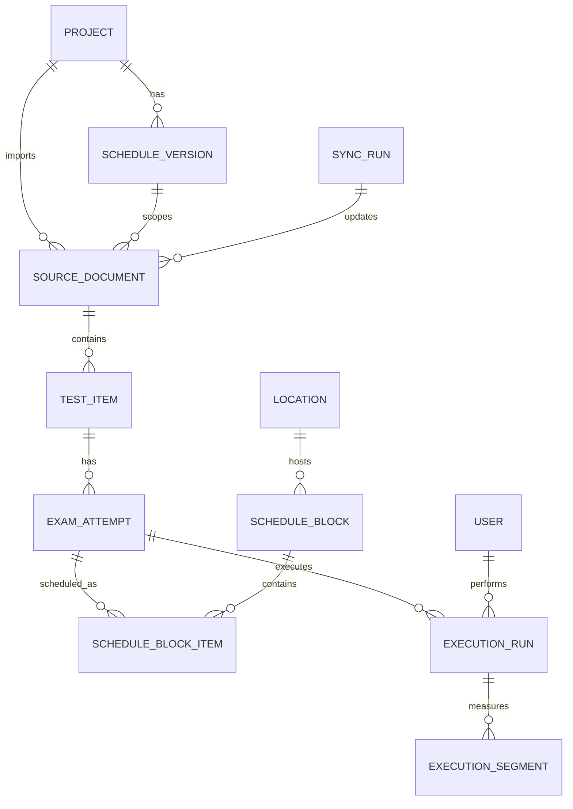

# 데이터 아키텍처 재설계안

이 문서는 현재 기능을 잃지 않으면서 데이터 구조를 다시 잡기 위한 기준 문서다.
목표는 새 기능이 붙어도 "어떤 데이터가 어디에 있고, 무엇을 기준으로 조합해야 하는지"를 바로 알 수 있게 만드는 것이다.

## 1. 현재 기능 정리

### 1.1 동기화

외부 provider 또는 로컬 JSON에서 시험 절차 데이터를 가져와 내부 작업 대상으로 만든다.

현재 지원 provider:

| provider | 역할 |
| --- | --- |
| `json_file` | `procedures.json`, `versions.json`에서 절차와 버전을 읽는다 |
| `rest_api` | 외부 `/versions`, `/procedures` API에서 읽는다. `API_BASE_URL`이 없으면 `json_file`로 폴백한다 |
| `dyn_ready` | `/dyn_ready/std-list/grouped`에서 읽는다. `updated_at`과 데이터 해시가 같으면 동기화를 스킵한다 |
| `std_list` 캐시 | MySQL `std_list`에서 `test_info -> exam_no` 매핑을 가져와 재시험 차수를 나눈다 |

현재 동기화 결과:

1. 외부 문서는 `tasks.json`의 task가 된다.
2. 문서 안의 시험 식별자는 task의 `identifiers[]` 안에 들어간다.
3. 같은 `doc_id`라도 `exam_no`가 다르면 다른 task가 된다.
4. 이미 스케줄된 식별자는 외부에서 사라져도 삭제하지 않고 경고한다.

### 1.2 스케줄링

관리자는 task 또는 task 안의 일부 식별자를 캘린더에 배치한다.

현재 지원 기능:

| 기능 | 설명 |
| --- | --- |
| 일간/주간/월간 캘린더 | 장소, 날짜, 시간 기준으로 block을 표시한다 |
| 큐 | 아직 전부 배치되지 않은 task 또는 식별자를 표시한다 |
| 식별자 일부 배치 | `identifier_ids`로 task 일부만 block에 포함한다 |
| 블록 이동/리사이즈 | 날짜, 시간, 장소를 바꾸고 충돌을 검사한다 |
| 블록 분리 | 하나의 block에서 일부 식별자를 떼어 새 block으로 만든다 |
| 큐 복귀 | block 또는 식별자를 다시 미배치 상태로 만든다 |
| 잠금 | 이동/리사이즈/일괄 이동에서 제외한다 |
| 휴식/업무시간 | 점심, 휴식, 실제 업무 종료 초과를 반영한다 |
| 단순 일정 | 시험 외 회의/준비 같은 일정을 만든다 |
| 내보내기 | CSV/XLSX로 현재 스케줄을 내보낸다 |

### 1.3 실행

시험 담당자는 식별자별로 실행을 시작하고, 일시정지/재개/완료를 기록한다.

현재 지원 기능:

| 기능 | 설명 |
| --- | --- |
| 실행 목록 | task 식별자 전체를 표시하고 날짜/장소 필터는 block 기준으로 좁힌다 |
| 실행 상세 | `identifier_id`와 `task_id`로 단일 실행 대상을 연다 |
| 타이머 | `segments[]`로 실제 동작 구간을 누적한다 |
| 결과 카운트 | `total_count`, `fail_count`, `block_count`, `pass_count`를 저장한다 |
| 수행자 | 세션 사용자 또는 수동 입력 수행자를 저장한다 |
| 코멘트 | 시작 전 pending 코멘트와 실행 후 코멘트를 저장한다 |
| 중복 진행 방지 | 같은 수행자가 다른 시험을 동시에 시작하지 못하게 한다 |
| 완료 알림 | 완료 후 `API_BASE_URL/update_test_time`으로 소요 시간을 비동기 전송한다 |
| 소요시간 반영 | `/execution/api/timing/<identifier_id>`가 식별자 예상 시간을 수정한다 |

### 1.4 기준정보와 설정

| 데이터 | 현재 역할 |
| --- | --- |
| 사용자 | 이름, 역할, 색상. task/block은 user id가 아니라 이름 문자열을 저장한다 |
| 장소 | 장소명, 색상, 설명. task/block은 location id를 저장한다 |
| 버전 | 외부 OFP 또는 스케줄 버전. 활성 버전을 선택할 수 있다 |
| 설정 | 근무시간, 실제 업무시간, 휴식, 그리드, 최대 스케줄 일수, 블록 색상 기준 |

## 2. 현재 구조의 문제

### 2.1 `tasks.json`이 너무 많은 책임을 가진다

현재 task는 아래 역할을 동시에 한다.

1. 외부 문서 또는 절차 원본
2. 시험 식별자 묶음
3. 재시험 차수 단위
4. 큐 항목
5. 기본 담당자/장소
6. 예상 시간 합계와 잔여 시간 캐시
7. 일부 취소 상태

이 구조는 처음에는 단순하지만, 기능이 늘면 "task가 정확히 무엇인가"가 모호해진다.

### 2.2 외부 ID와 내부 ID가 섞여 있다

`identifier_id`는 외부 시험 ID다. 같은 ID가 다른 `exam_no`나 다른 task에 존재할 수 있으므로 전역 고유 ID가 아니다.

현재는 `(identifier_id, task_id)`를 같이 써서 구분하지만, 이 규칙이 모든 데이터 모델에 명시되어 있지 않아 새 기능에서 실수하기 쉽다.

### 2.3 계획 상태와 실행 상태가 섞인다

`schedule_blocks.json.block_status`는 저장돼 있지만 일반 block은 화면에서 execution 상태로 다시 계산된다.
즉 저장된 값과 화면 상태가 항상 같은 의미가 아니다.

### 2.4 계산값과 원천값이 섞인다

`estimated_minutes`는 원천값에 가깝지만, `/execution/api/timing`으로 수정되기도 한다.
`remaining_minutes`는 block 상태에서 계산 가능한 캐시다.
이런 값은 소유권이 분명해야 한다.

### 2.5 JSON 파일은 관계를 표현하기 어렵다

현재 데이터는 관계형이다.

문서 -> 식별자 -> 재시험 차수 -> 스케줄 배치 -> 실행 기록

하지만 JSON 배열 여러 개에 나뉘어 있어 제약, 조회, 마이그레이션, 삭제 정책이 코드 곳곳에 흩어진다.

## 3. 재설계 원칙

1. 외부 원본 데이터와 내부 운영 데이터를 분리한다.
2. 전역 고유 내부 ID를 모든 핵심 엔티티에 부여한다.
3. 외부 ID는 표시/연동 키로만 저장하고, 내부 조인은 내부 ID로 한다.
4. 계획 데이터와 실행 데이터는 서로 쓰지 않는다.
5. 계산 가능한 값은 저장하지 않거나, 저장하더라도 캐시임을 명시한다.
6. 새 기능은 원천 테이블이 아니라 읽기 모델 또는 API를 통해 데이터를 가져간다.
7. 삭제보다 비활성/보존 정책을 우선한다. 특히 이미 배치되거나 실행된 데이터는 물리 삭제하지 않는다.
8. UI는 preview와 render를 담당하고, 업무 규칙과 최종 truth는 백엔드 service가 담당한다.
9. 저장소는 JSON 또는 DB로 바뀔 수 있으므로 route/service가 파일 구조나 테이블 구조에 직접 의존하지 않는다.

## 4. 저장소 독립 구조

저장소는 처음에는 JSON 파일일 수 있고, 나중에는 SQLite 또는 다른 DB일 수 있다.
따라서 먼저 도메인 모델과 service/repository 인터페이스를 고정하고, 저장 구현체만 교체 가능하게 만든다.

```text
UI
  -> API Route
    -> Service
      -> Repository Interface
        -> JSON Repository
        -> SQL Repository
```

### 4.1 Repository 인터페이스 예시

```python
class CatalogRepository:
    def list_documents(self): ...
    def list_exam_attempts(self): ...
    def upsert_synced_catalog(self, payload): ...


class ScheduleRepository:
    def list_blocks(self, start_date, end_date): ...
    def create_block(self, block): ...
    def set_block_items(self, block_id, attempt_ids): ...


class ExecutionRepository:
    def get_run(self, attempt_id): ...
    def start(self, attempt_id, performer): ...
    def pause(self, run_id): ...
    def complete(self, run_id, fail_count, block_count): ...
```

처음에는 아래 구현체를 사용한다.

```text
JsonCatalogRepository    -> catalog.json
JsonScheduleRepository   -> schedule.json
JsonExecutionRepository  -> executions.json
```

나중에 DB로 전환하면 같은 인터페이스에 SQL 구현체를 붙인다.

```text
SqlCatalogRepository     -> documents/test_items/exam_attempts tables
SqlScheduleRepository    -> schedule_blocks/block_items tables
SqlExecutionRepository   -> execution_runs/execution_segments tables
```

### 4.2 JSON과 DB의 역할 차이

JSON은 사람이 읽고 백업하기 쉬워야 한다. 따라서 DB 테이블처럼 너무 잘게 쪼개지 않는다.
DB는 제약과 조회 성능이 중요하므로 엔티티별 테이블로 분리한다.

중요한 것은 두 저장소가 같은 도메인 객체를 반환하게 만드는 것이다.

| 도메인 | JSON 구현 | DB 구현 |
| --- | --- | --- |
| 카탈로그 | `catalog.json` 안의 `documents`, `test_items`, `exam_attempts` | `source_documents`, `test_items`, `exam_attempts` |
| 스케줄 | `schedule.json` 안의 `blocks`, `block_items` | `schedule_blocks`, `schedule_block_items` |
| 실행 | `executions.json` 안의 `runs[].segments` | `execution_runs`, `execution_segments` |
| 기준정보 | `resources.json` 안의 `users`, `locations`, `versions` | `users`, `locations`, `schedule_versions` |
| 설정 | `settings.json` | `work_calendar_settings` 또는 config table |

### 4.3 코드 구조 원칙

코드는 문제가 생겼을 때 어느 파일을 봐야 하는지 바로 알 수 있어야 한다.
기능이 늘어나도 route, service, repository, view model의 책임을 섞지 않는다.

권장 구조:

```text
app/
├── domain/
│   ├── models.py              # 저장소와 무관한 도메인 객체
│   ├── ids.py                 # 내부 ID, 외부 ID 규칙
│   └── errors.py              # 도메인 예외
├── services/
│   ├── catalog_service.py     # 동기화/문서/식별자/차수 규칙
│   ├── schedule_service.py    # 배치/분할/복귀/시간/충돌 규칙
│   ├── execution_service.py   # 시작/정지/완료/결과 규칙
│   ├── export_service.py      # 외부 제공용 snapshot/export
│   └── read_models.py         # 화면/API 응답용 조합 모델
├── repositories/
│   ├── interfaces.py          # 저장소 인터페이스
│   ├── json_repository.py     # compact JSON 구현
│   └── sql_repository.py      # DB 구현
└── routes/
    ├── schedule.py            # HTTP request/response만 담당
    ├── execution.py
    ├── admin.py
    └── external_data.py       # 외부 데이터 제공 API
```

레이어별 책임:

| 레이어 | 해야 하는 일 | 하지 말아야 하는 일 |
| --- | --- | --- |
| Route | 요청 파싱, 인증/권한, service 호출, 응답 반환 | 파일 직접 읽기, 업무 규칙 계산 |
| Service | 업무 규칙, 검증, 상태 전이, 여러 repository 조합 | HTTP 세부사항, 템플릿 렌더링 |
| Repository | 저장/조회 구현 | 업무 규칙 판단 |
| Read model | 화면/API가 바로 쓸 데이터 조합 | 저장 규칙 변경 |
| UI | preview, 입력 수집, 렌더링 | 최종 업무 규칙 판단 |

파일이 커질 때의 분리 기준:

1. 한 파일이 300~400줄을 넘고 서로 다른 이유로 자주 바뀌면 나눈다.
2. 함수가 저장소와 UI 응답을 동시에 다루면 service와 read model로 나눈다.
3. 같은 규칙이 프론트/백엔드 또는 여러 route에 반복되면 service로 올린다.
4. 외부에서 가져갈 데이터 조합은 route 안에서 만들지 말고 `export_service.py` 또는 read model로 만든다.
5. "이 값이 저장값인지 계산값인지"가 불분명하면 이름에 `_snapshot`, `_cache`, `derived_` 같은 의미를 명시한다.

## 5. 새 도메인 모델

### 5.1 핵심 엔티티

| 엔티티 | 한 줄 설명 | 현재 구조의 대응 |
| --- | --- | --- |
| `Project` | 하나의 시험 운영 단위 | 현재는 명시적 모델 없음 |
| `ScheduleVersion` | OFP/스케줄 버전 | `versions.json` |
| `SourceDocument` | 외부 문서/절차 원본 | `tasks.json`의 `doc_id`, `doc_name` |
| `TestItem` | 문서 안의 시험 식별자 원본 | `tasks.json[].identifiers[]` |
| `ExamAttempt` | 특정 시험 식별자의 N차 수행 대상 | 현재 `task + exam_no + identifier` 조합 |
| `ScheduleBlock` | 캘린더의 시간 블록 | `schedule_blocks.json` |
| `ScheduleBlockItem` | block에 포함된 수행 대상 목록 | `schedule_blocks.identifier_ids` |
| `ExecutionRun` | 수행 대상의 실행 기록 | `executions.json` |
| `ExecutionSegment` | 타이머 동작 구간 | `executions[].segments[]` |
| `User` | 담당자/수행자 기준정보 | `users.json` |
| `Location` | 장소 기준정보 | `locations.json` |
| `WorkCalendarSettings` | 근무시간/휴식 설정 | `settings.json` |
| `SyncRun` | 동기화 실행 이력 | 현재는 명시적 모델 없음 |
| `ExternalSourceSnapshot` | provider 응답 원본/해시 | `procedures.json`, `dyn_ready_meta.json` |

### 5.2 관계도



## 6. 엔티티별 설계

### 6.1 `Project`

시험 운영의 최상위 단위다. 지금은 단일 프로젝트처럼 동작하지만, 새 구조에서는 명시적으로 둔다.

| 필드 | 설명 |
| --- | --- |
| `id` | 내부 프로젝트 ID |
| `name` | 프로젝트 이름 |
| `status` | `active`, `archived` |
| `created_at` | 생성 시각 |

새 기능이 특정 프로젝트의 데이터만 가져가야 한다면 모든 주요 조회는 `project_id`를 기준으로 시작한다.

### 6.2 `ScheduleVersion`

OFP 또는 스케줄 버전이다.

| 필드 | 설명 |
| --- | --- |
| `id` | 내부 버전 ID |
| `project_id` | 소속 프로젝트 |
| `external_version_id` | 외부 OFP ID. 예: `MAE31F` |
| `name` | 표시 이름 |
| `description` | 설명 |
| `is_active` | 활성 여부 |
| `created_at` | 생성 시각 |

원칙:

1. 내부 조인은 `id`를 사용한다.
2. 외부 API 호출에는 `external_version_id`를 사용한다.

### 6.3 `SourceDocument`

외부 문서/절차 원본이다. 문서 자체는 시험 차수와 분리한다.

| 필드 | 설명 |
| --- | --- |
| `id` | 내부 문서 ID |
| `project_id` | 소속 프로젝트 |
| `version_id` | 연결 버전 |
| `external_doc_id` | 외부 문서 ID |
| `doc_name` | 문서명 |
| `section_name` | 구 호환 절차명 |
| `source_provider` | `json_file`, `rest_api`, `dyn_ready` |
| `source_hash` | 문서 단위 응답 해시 |
| `is_active` | 최신 동기화에서 살아 있는지 여부 |
| `created_at`, `updated_at` | 생성/갱신 시각 |

권장 제약:

```text
unique(project_id, version_id, external_doc_id)
```

### 6.4 `TestItem`

문서 안의 시험 식별자 원본이다.

| 필드 | 설명 |
| --- | --- |
| `id` | 내부 시험 식별자 ID |
| `document_id` | 상위 문서 |
| `external_test_id` | 외부 식별자. 예: `TC-001` |
| `name` | 시험 항목명 |
| `estimated_minutes` | 계획 기준 예상 시간 |
| `total_count` | 전체 시험 건수 |
| `owner_names` | 작성자/개발자 이름 목록. SQLite에서는 JSON 문자열 또는 별도 테이블 |
| `is_active` | 최신 동기화에서 살아 있는지 여부 |
| `created_at`, `updated_at` | 생성/갱신 시각 |

권장 제약:

```text
unique(document_id, external_test_id)
```

주의:

`external_test_id`는 전역 고유 ID가 아니다. 새 기능은 이 값만으로 실행/스케줄 데이터를 조회하면 안 된다.

### 6.5 `ExamAttempt`

실제 운영 단위다. "이 시험 식별자를 몇 차로 수행하는가"를 나타낸다.

| 필드 | 설명 |
| --- | --- |
| `id` | 내부 수행 대상 ID |
| `test_item_id` | 원본 시험 식별자 |
| `exam_no` | 시험 차수. 없으면 `1` 또는 `null` 정책 중 하나로 통일 |
| `default_location_id` | 기본 장소 |
| `default_assignee_names` | 기본 담당자 이름 목록 |
| `memo` | 운영 메모 |
| `state` | `active`, `cancelled`, `archived` |
| `created_at`, `updated_at` | 생성/갱신 시각 |

권장 제약:

```text
unique(test_item_id, exam_no)
```

현재의 `(task_id, identifier_id)`는 새 구조에서 `exam_attempt.id` 하나로 대체한다.

### 6.6 `ScheduleBlock`

캘린더에 보이는 시간 영역이다.

| 필드 | 설명 |
| --- | --- |
| `id` | 내부 block ID |
| `project_id` | 소속 프로젝트 |
| `date` | 날짜 |
| `start_time` | 시작 시각 |
| `end_time` | 종료 시각 |
| `location_id` | 장소 |
| `assignee_names` | 담당자 이름 목록 |
| `kind` | `test`, `simple` |
| `title` | 단순 일정 제목 |
| `memo` | block 메모 |
| `is_locked` | 잠금 여부 |
| `manual_status` | `cancelled` 같은 수동 상태. 일반 진행 상태는 저장하지 않는다 |
| `overflow_minutes` | 업무 종료 초과분 캐시 |
| `created_at`, `updated_at` | 생성/갱신 시각 |

원칙:

1. block은 "언제, 어디서"의 컨테이너다.
2. 어떤 시험이 들어 있는지는 `ScheduleBlockItem`이 가진다.
3. 진행 상태는 execution에서 계산한다.
4. 단순 일정은 `kind='simple'`이고 `ScheduleBlockItem`이 없다.

### 6.7 `ScheduleBlockItem`

block과 수행 대상을 연결한다.

| 필드 | 설명 |
| --- | --- |
| `id` | 내부 ID |
| `block_id` | 스케줄 block |
| `exam_attempt_id` | 수행 대상 |
| `sort_order` | block 안 표시 순서 |

권장 제약:

```text
unique(block_id, exam_attempt_id)
```

이 구조를 쓰면 현재의 `identifier_ids=null` 특수 규칙이 사라진다.
전체 배치도 block item을 수행 대상 수만큼 만든다.

### 6.8 `ExecutionRun`

시험 실행의 원장이다.

| 필드 | 설명 |
| --- | --- |
| `id` | 내부 실행 ID |
| `exam_attempt_id` | 수행 대상 |
| `status` | `pending`, `in_progress`, `paused`, `completed` |
| `total_count` | 실행 시점의 전체 건수 스냅샷 |
| `fail_count` | 실패 건수 |
| `block_count` | 블록/보류 건수 |
| `pass_count` | 통과 건수 |
| `performer_name` | 수행자 이름 |
| `comment` | 코멘트 |
| `started_at` | 시작 시각 |
| `completed_at` | 완료 시각 |
| `elapsed_seconds_snapshot` | 저장된 경과 시간 스냅샷 |
| `created_at`, `updated_at` | 생성/갱신 시각 |

원칙:

1. 같은 `exam_attempt_id`에 대해 현재 활성 실행은 하나만 둔다.
2. 재시작은 기존 run을 초기화할지, 새 attempt run을 만들지 정책을 명시해야 한다.
3. 이 프로젝트에서는 우선 기존 동작과 맞춰 "같은 run 초기화"를 유지한다.

### 6.9 `ExecutionSegment`

타이머 동작 구간이다.

| 필드 | 설명 |
| --- | --- |
| `id` | 내부 구간 ID |
| `execution_run_id` | 실행 레코드 |
| `start_at` | 구간 시작 |
| `end_at` | 구간 종료. 진행 중이면 null |

경과 시간은 segment 합계로 계산한다.

### 6.10 `User`, `Location`, `WorkCalendarSettings`

기준정보는 현재 기능을 유지하되 참조 방식을 분명히 한다.

`User`:

| 필드 | 설명 |
| --- | --- |
| `id` | 내부 사용자 ID |
| `name` | 표시 이름 |
| `role` | 역할 |
| `color` | 색상 |
| `is_active` | 활성 여부 |

`Location`:

| 필드 | 설명 |
| --- | --- |
| `id` | 내부 장소 ID |
| `name` | 장소명 |
| `color` | 색상 |
| `description` | 설명 |
| `is_active` | 활성 여부 |

`WorkCalendarSettings`:

| 필드 | 설명 |
| --- | --- |
| `project_id` | 프로젝트 |
| `work_start`, `work_end` | 화면 표시 범위 |
| `actual_work_start`, `actual_work_end` | 자동 배치 기준 |
| `lunch_start`, `lunch_end` | 점심 시간 |
| `breaks_json` | 추가 휴식 목록 |
| `grid_interval_minutes` | 격자 간격 |
| `max_schedule_days` | 자동 배치 최대 일수 |
| `block_color_by` | `assignee`, `location`, `status` |

## 7. 데이터 소유권

새 기능을 만들 때는 아래 표를 기준으로 데이터를 가져간다.

| 필요한 정보 | 기준 엔티티/API | 직접 읽으면 안 되는 것 |
| --- | --- | --- |
| 절차/문서 목록 | `SourceDocument` | `ScheduleBlock` |
| 시험 식별자 원본 | `TestItem` | `ExecutionRun` |
| 차수별 수행 대상 | `ExamAttempt` | `external_test_id` 단독 조회 |
| 큐에 남은 항목 | `UnscheduledAttempt` 읽기 모델 | `remaining_minutes` 캐시 |
| 캘린더 block | `ScheduleBlock` + `ScheduleBlockItem` | execution 상태 저장값 |
| 실행 목록 | `ExecutionListItem` 읽기 모델 | 여러 테이블을 화면마다 임의 조합 |
| 실행 결과 | `ExecutionRun` + `ExecutionSegment` | `ScheduleBlock` |
| 내보내기 | `ScheduleExportRow` 읽기 모델 | 템플릿에서 직접 조합 |
| 외부 완료 알림 | `ExecutionRun` + `ScheduleVersion.external_version_id` | task의 `version_id` 문자열 |

## 8. 권장 읽기 모델

새 기능은 원천 테이블을 직접 많이 조인하기보다 읽기 모델을 통해 가져간다.
SQLite에서는 VIEW 또는 서비스 함수로 구현할 수 있다.

### 8.1 `ExecutionListItem`

실행 목록 화면과 외부 기능이 가장 자주 사용할 읽기 모델이다.

| 필드 | 설명 |
| --- | --- |
| `exam_attempt_id` | 수행 대상 ID |
| `document_id` | 문서 ID |
| `doc_name` | 문서명 |
| `external_test_id` | 표시 식별자 |
| `test_name` | 시험 항목명 |
| `exam_no` | 차수 |
| `display_name` | `doc_name` + 차수 표시 |
| `owner_names` | 작성자/개발자 |
| `estimated_minutes` | 예상 시간 |
| `total_count` | 전체 건수 |
| `scheduled_date` | 가장 이른 배치 날짜 |
| `location_id`, `location_name` | 배치 장소 우선, 없으면 기본 장소 |
| `execution_status` | execution 기반 상태 |
| `performer_name` | 수행자 |
| `fail_count`, `block_count`, `pass_count` | 결과 |
| `elapsed_seconds` | segment 기반 경과 시간 |

### 8.2 `ScheduleExportRow`

CSV/XLSX 내보내기 기준 모델이다.

| 필드 | 설명 |
| --- | --- |
| `block_id` | block ID |
| `date`, `start_time`, `end_time` | 배치 시간 |
| `location_name` | 장소 |
| `assignee_names` | 담당자 |
| `doc_name` | 문서명 |
| `external_test_ids` | block 안 식별자 목록 |
| `split_label` | `N/M` |
| `execution_status` | 실행 기반 상태 |
| `memo` | 메모 |
| `version_name` | 버전 |

### 8.3 `UnscheduledAttempt`

큐 표시 기준 모델이다.

| 필드 | 설명 |
| --- | --- |
| `exam_attempt_id` | 미배치 수행 대상 |
| `doc_name` | 문서명 |
| `external_test_id` | 식별자 |
| `test_name` | 시험명 |
| `remaining_minutes` | 미배치 예상 시간 |
| `default_location_id` | 기본 장소 |
| `owner_names` | 작성자 |
| `execution_status` | 실행 상태 |

## 9. 새 API 구조

현재 API는 화면 중심과 도메인 중심이 섞여 있다.
새 구조에서는 도메인 API와 화면 전용 읽기 API를 분리한다.

| API | 역할 |
| --- | --- |
| `GET /api/documents` | 문서 목록 |
| `GET /api/test-items?document_id=...` | 문서의 시험 식별자 |
| `GET /api/exam-attempts` | 차수별 수행 대상 |
| `GET /api/queue-items` | 큐 표시용 미배치 목록 |
| `GET /api/schedule-blocks` | block 목록 |
| `POST /api/schedule-blocks` | block 생성 |
| `POST /api/schedule-blocks/<id>/items` | block에 수행 대상 추가 |
| `DELETE /api/schedule-blocks/<id>/items/<item_id>` | block에서 수행 대상 제거 |
| `GET /api/execution-items` | 실행 목록 읽기 모델 |
| `POST /api/executions/start` | 실행 시작 |
| `POST /api/executions/pause` | 일시정지 |
| `POST /api/executions/resume` | 재개 |
| `POST /api/executions/complete` | 완료 |
| `POST /api/sync-runs` | 동기화 실행 |
| `GET /api/exports/schedule` | 내보내기 |

기존 URL은 한동안 유지하고 내부에서 새 서비스로 위임한다.

### 9.1 외부 데이터 제공 계약

data 폴더 안의 내부 저장 파일은 외부 연동 계약으로 삼지 않는다.
JSON 파일 구조는 운영 편의나 DB 전환에 따라 바뀔 수 있기 때문이다.
외부 시스템이 데이터를 가져가야 한다면 stable API 또는 export snapshot을 제공한다.

원칙:

1. 외부에는 내부 저장 파일명이 아니라 버전이 있는 데이터 계약을 제공한다.
2. 외부 공개 ID와 내부 ID를 함께 제공한다.
3. 계산값은 어떤 기준으로 계산됐는지 필드명과 설명을 명확히 한다.
4. 스케줄/실행 상태는 read model에서 계산한 값을 제공한다.
5. DB로 전환해도 외부 API 응답 구조는 유지한다.

권장 외부 API:

| API | 용도 |
| --- | --- |
| `GET /api/external/v1/catalog` | 문서, 시험 식별자, 차수별 수행 대상 |
| `GET /api/external/v1/schedule?start_date=...&end_date=...` | 기간별 스케줄과 block item |
| `GET /api/external/v1/executions?date=...` | 실행 상태와 결과 |
| `GET /api/external/v1/snapshot` | catalog, schedule, executions를 한 번에 가져가는 통합 snapshot |
| `GET /api/external/v1/metadata` | 데이터 계약 버전, 생성 시각, source hash |

통합 snapshot 예시:

```json
{
  "schema_version": "1.0",
  "generated_at": "2026-07-11T09:00:00",
  "project": {
    "id": "proj_default",
    "name": "Default Project"
  },
  "catalog": {
    "documents": [],
    "test_items": [],
    "exam_attempts": []
  },
  "schedule": {
    "blocks": [],
    "block_items": []
  },
  "executions": {
    "runs": []
  },
  "resources": {
    "users": [],
    "locations": [],
    "versions": []
  }
}
```

외부 공개 필드 기준:

| 필드 | 설명 |
| --- | --- |
| `schema_version` | 외부 데이터 계약 버전 |
| `generated_at` | snapshot 생성 시각 |
| `id` | 내부 안정 ID. 외부가 다음 조회에 사용할 수 있음 |
| `external_*` | 외부 원본 시스템의 ID |
| `display_*` | 화면/보고서용 표시값 |
| `derived_*` | read model에서 계산된 값 |
| `source_hash` | 원본 또는 snapshot 변경 감지용 해시 |

외부 제공용 파일이 필요하면 내부 data 파일을 그대로 복사하지 않고 `exports/` 아래에 snapshot을 생성한다.

```text
exports/
├── external-snapshot-v1.json
├── schedule-2026-07-01_2026-07-31.json
└── executions-2026-07-11.json
```

이 파일들은 재생성 가능한 산출물이다. 운영 원본은 compact JSON 또는 DB가 가진다.

## 10. 상태 규칙

### 10.1 스케줄 상태

스케줄 block의 일반 진행 상태는 저장하지 않는다.

표시 상태 계산:

1. block에 포함된 모든 `ExamAttempt`의 execution이 completed면 `completed`
2. 하나라도 `in_progress`, `paused`, `completed`면 `in_progress`
3. 모두 실행 전이면 `pending`
4. block의 `manual_status='cancelled'`면 `cancelled`

### 10.2 실행 상태

```text
pending -> in_progress -> paused -> in_progress -> completed
```

pending은 두 가지가 있다.

1. 실행 레코드가 없음
2. 시작 전 코멘트 또는 reset 때문에 pending run이 있음

API 응답에서는 둘 다 pending으로 다룬다.

### 10.3 삭제 상태

동기화에서 사라진 데이터는 다음 기준으로 처리한다.

| 대상 | 스케줄/실행 없음 | 스케줄 또는 실행 있음 |
| --- | --- | --- |
| 문서 | 비활성 또는 삭제 가능 | 비활성으로 표시하고 보존 |
| 시험 식별자 | 비활성 또는 삭제 가능 | 비활성으로 표시하고 보존 |
| 수행 대상 | 비활성 또는 삭제 가능 | 비활성으로 표시하고 보존 |
| block | 사용자 삭제만 허용 | 사용자 삭제만 허용 |
| execution | reset/보관 정책만 허용 | 물리 삭제 금지 |

## 11. 기존 데이터에서 새 구조로의 매핑

### 11.1 `tasks.json`

| 현재 필드 | 새 엔티티/필드 |
| --- | --- |
| `task.id` | migration용 legacy id. `ExamAttempt.legacy_task_id`로 임시 보존 |
| `task.doc_id` | `SourceDocument.external_doc_id` |
| `task.version_id` | `ScheduleVersion.external_version_id` 또는 `ScheduleVersion.id` |
| `task.doc_name` | `SourceDocument.doc_name` |
| `task.exam_no` | `ExamAttempt.exam_no` |
| `task.assignee_names` | `ExamAttempt.default_assignee_names` |
| `task.location_id` | `ExamAttempt.default_location_id` |
| `task.identifiers[].id` | `TestItem.external_test_id` |
| `task.identifiers[].name` | `TestItem.name` |
| `task.identifiers[].owners` | `TestItem.owner_names` |
| `task.identifiers[].estimated_minutes` | `TestItem.estimated_minutes` |
| `task.identifiers[].total_count` | `TestItem.total_count` |
| `task.memo` | `ExamAttempt.memo` |
| `task.remaining_minutes` | 저장하지 않고 `UnscheduledAttempt`에서 계산 |

주의:

현재 task 하나에 여러 identifier가 들어 있고 task 하나가 하나의 `exam_no`를 갖는다.
마이그레이션 시 identifier마다 `ExamAttempt`를 하나씩 만든다.

### 11.2 `schedule_blocks.json`

| 현재 필드 | 새 엔티티/필드 |
| --- | --- |
| `id` | `ScheduleBlock.legacy_block_id`로 임시 보존 |
| `task_id` | `ScheduleBlockItem.exam_attempt_id`를 찾기 위한 legacy 연결 |
| `identifier_ids` | 각 ID마다 `ScheduleBlockItem` 생성 |
| `identifier_ids=null` | 해당 task의 모든 identifier에 대해 `ScheduleBlockItem` 생성 |
| `date`, `start_time`, `end_time` | `ScheduleBlock` |
| `location_id` | `ScheduleBlock.location_id` |
| `assignee_names` | `ScheduleBlock.assignee_names` |
| `is_locked` | `ScheduleBlock.is_locked` |
| `block_status='cancelled'` | `ScheduleBlock.manual_status='cancelled'` |
| `memo` | `ScheduleBlock.memo` |
| `is_simple`, `title` | `ScheduleBlock.kind='simple'`, `title` |
| `overflow_minutes` | `ScheduleBlock.overflow_minutes` |

### 11.3 `executions.json`

| 현재 필드 | 새 엔티티/필드 |
| --- | --- |
| `id` | `ExecutionRun.legacy_execution_id`로 임시 보존 |
| `identifier_id`, `task_id` | `ExamAttempt.id` 조회 키 |
| `exam_no` | 마이그레이션 검증용. 최종 조인은 `ExamAttempt.id` |
| `status` | `ExecutionRun.status` |
| `segments[]` | `ExecutionSegment` |
| `total_count` | `ExecutionRun.total_count` |
| `fail_count`, `block_count`, `pass_count` | `ExecutionRun` |
| `comment` | `ExecutionRun.comment` |
| `performer` | `ExecutionRun.performer_name` |
| `completed_at` | `ExecutionRun.completed_at` |
| `elapsed_seconds`, `elapsed_mins` | `ExecutionRun.elapsed_seconds_snapshot` |

## 12. 마이그레이션 계획

### 12.1 1단계: 도메인 모델과 읽기 모델 만들기

1. 저장소와 무관한 도메인 객체를 정의한다.
2. `ExecutionListItem`, `ScheduleExportRow`, `UnscheduledAttempt` 읽기 모델을 만든다.
3. 기존 JSON을 읽어 새 도메인 객체로 변환하는 adapter를 만든다.
4. 읽기 모델이 기존 화면과 같은 결과를 내는지 테스트한다.

### 12.2 2단계: 서비스 계층 추가

1. 기존 route가 JSON repository를 직접 부르지 않도록 서비스 계층을 만든다.
2. service는 repository 인터페이스만 호출한다.
3. 첫 구현체는 compact JSON repository로 둔다.
4. 기존 URL은 유지하고 내부 구현만 service로 위임한다.

### 12.3 3단계: compact JSON 쓰기 경로 전환

전환 순서:

1. 기준정보와 설정
2. 동기화
3. 스케줄 block
4. execution
5. export

이 순서가 안전한 이유는 execution이 스케줄과 식별자 ID에 가장 강하게 의존하기 때문이다.

### 12.4 4단계: DB repository 추가

1. 같은 compact snapshot 계약으로 SQLAlchemy ORM 구현체를 둔다.
2. legacy JSON에서 compact snapshot을 만든 뒤 DB에 적재하는 migration을 제공한다.
3. route/service/frontend는 바꾸지 않고 `EXTERNAL_DATA_SOURCE=orm` 설정으로 외부 API를 검증한다.
4. DB 전환 후에도 JSON export/import 또는 백업 도구를 유지한다.

현재 브랜치의 1차 ORM 구현:

| 파일 | 역할 |
| --- | --- |
| `app/db/models.py` | compact domain ORM 테이블 |
| `app/db/repository.py` | snapshot replace/load repository |
| `scripts/migrate_legacy_to_db.py` | legacy JSON -> ORM DB 적재 |
| `app/features/external_data/routes.py` | `EXTERNAL_DATA_SOURCE=orm`일 때 ORM snapshot 조회 |

### 12.5 5단계: legacy 필드 제거

새 구조가 안정되면 아래를 제거한다.

1. `identifier_ids=null` 특수 규칙
2. `remaining_minutes` 저장 필드
3. task의 `status`
4. block의 일반 `block_status`
5. `(identifier_id, task_id)` 조인 규칙

## 13. 검증 기준

마이그레이션 후 반드시 통과해야 하는 기준:

1. 동기화 후 문서/식별자/차수가 기존과 같은 개수로 보인다.
2. 큐에 남는 항목과 남은 시간이 기존과 같다.
3. 일간/주간/월간 block 표시가 기존과 같다.
4. 분할 block의 `N/M` 표시가 기존과 같다.
5. execution 목록에서 동일 식별자 다른 차수가 섞이지 않는다.
6. 기존 완료 기록의 fail/block/pass/elapsed가 유지된다.
7. CSV/XLSX export가 기존 필드를 모두 포함한다.
8. 외부 완료 알림의 `test_id`, `ofp_id`, `time_taking` 값이 유지된다.

## 14. Compact JSON 구현안

JSON으로 운용한다면 파일 수를 너무 늘리지 않는다.
파일은 사람이 읽고 백업하기 쉬워야 하므로 5개 정도로 묶고, 파일 안에서 도메인 배열을 나눈다.

```text
data/
├── catalog.json
├── schedule.json
├── executions.json
├── resources.json
└── settings.json
```

### 14.1 `catalog.json`

동기화된 문서, 식별자, 차수별 수행 대상을 담는다.

```json
{
  "documents": [],
  "test_items": [],
  "exam_attempts": [],
  "sync": {
    "provider": "dyn_ready",
    "updated_at": "",
    "data_hash": ""
  }
}
```

### 14.2 `schedule.json`

캘린더 block과 block에 포함된 수행 대상을 담는다.

```json
{
  "blocks": [],
  "block_items": []
}
```

`block_items`를 분리하면 현재의 `identifier_ids=null` 특수 규칙 없이 전체 배치와 일부 배치를 같은 방식으로 표현할 수 있다.

### 14.3 `executions.json`

실행 기록을 담는다. JSON에서는 segment를 별도 파일로 분리하지 않고 run 안에 둔다.

```json
{
  "runs": [
    {
      "id": "run_001",
      "exam_attempt_id": "ea_001",
      "status": "in_progress",
      "segments": [
        {"start": "2026-05-13T09:00:00", "end": null}
      ]
    }
  ]
}
```

### 14.4 `resources.json`

사용자, 장소, 버전을 묶는다.

```json
{
  "users": [],
  "locations": [],
  "versions": []
}
```

### 14.5 `settings.json`

근무 시간, 화면 설정, provider 캐시처럼 단일 설정 성격의 값을 담는다.

```json
{
  "work_start": "08:00",
  "work_end": "17:00",
  "actual_work_start": "08:30",
  "actual_work_end": "16:30",
  "breaks": [],
  "block_color_by": "status",
  "provider_cache": {
    "dyn_ready": {
      "updated_at": "",
      "data_hash": ""
    }
  }
}
```

### 14.6 DB 전환 매핑

| Compact JSON | DB 테이블 |
| --- | --- |
| `catalog.documents` | `source_documents` |
| `catalog.test_items` | `test_items` |
| `catalog.exam_attempts` | `exam_attempts` |
| `schedule.blocks` | `schedule_blocks` |
| `schedule.block_items` | `block_items` |
| `executions.runs` | `execution_runs` |
| `executions.runs[].segments` | 1차 ORM에서는 `execution_runs.segments` JSON, 필요 시 `execution_segments`로 분리 |
| `resources.users` | `resource_records(kind='users')` |
| `resources.locations` | `resource_records(kind='locations')` |
| `resources.versions` | `resource_records(kind='versions')` |
| `settings` | `app_settings` |

Compact JSON에서도 핵심 원칙은 같다.

1. 외부 ID로 조인하지 않는다.
2. block과 block item은 분리한다.
3. execution segment는 JSON에서는 nested, DB에서는 테이블로 분리한다.
4. 계산값은 read model에서 만든다.
5. 삭제 대신 `is_active`, `state`, `archived_at`을 사용한다.

## 15. UI 책임 원칙

UI는 표시와 사용자 입력 수집에 집중한다.
업무 규칙은 백엔드 service가 소유한다.

```text
UI event
  -> API command
    -> Service validates/calculates
      -> Repository saves
        -> API returns view model
          -> UI renders
```

UI가 가져도 되는 책임:

1. 드래그 중 좌표와 preview 계산
2. 모달 열기/닫기
3. 선택, 필터, 정렬 같은 화면 상태
4. 서버가 준 view model 렌더링
5. localStorage 기반 개인 화면 설정

백엔드로 옮겨야 하는 책임:

1. 큐에 남은 수행 대상 계산
2. block 분할/복귀 규칙
3. 휴식 시간과 업무 종료 초과 계산
4. block 충돌 검사
5. execution 상태 계산
6. pass/fail/block 결과 계산
7. 재시험 차수 구분
8. 외부 동기화 병합 규칙

프론트엔드가 preview를 하더라도 최종 저장 결과는 항상 백엔드 응답을 신뢰한다.

## 16. 추천 결론

추천 경로는 다음과 같다.

1. 새 코드는 도메인 모델과 repository 인터페이스를 기준으로 설계한다.
2. 당장은 compact JSON 5개 파일 구조로 운용할 수 있게 한다.
3. 화면은 당장 크게 바꾸지 않는다.
4. 먼저 읽기 모델을 맞춘 뒤 쓰기 경로를 하나씩 옮긴다.
5. DB가 필요하면 기존 JSON 쓰기 경로를 한 번에 바꾸지 말고 ORM repository로 읽기 경로부터 검증한 뒤 쓰기 경로를 단계적으로 옮긴다.
6. 새 기능은 반드시 `ExamAttempt.id` 또는 읽기 모델 API를 기준으로 붙인다.
7. UI에는 preview/render만 남기고 업무 규칙은 service로 옮긴다.

이 방식이면 현재 기능을 유지하면서도 데이터 구조를 다시 이해 가능한 형태로 만들 수 있다.
